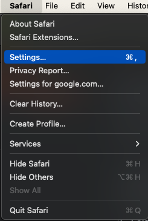
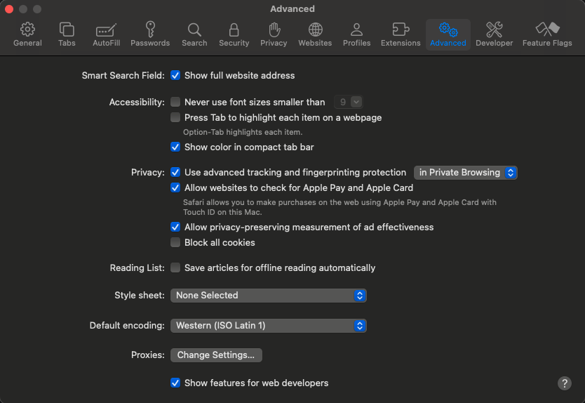
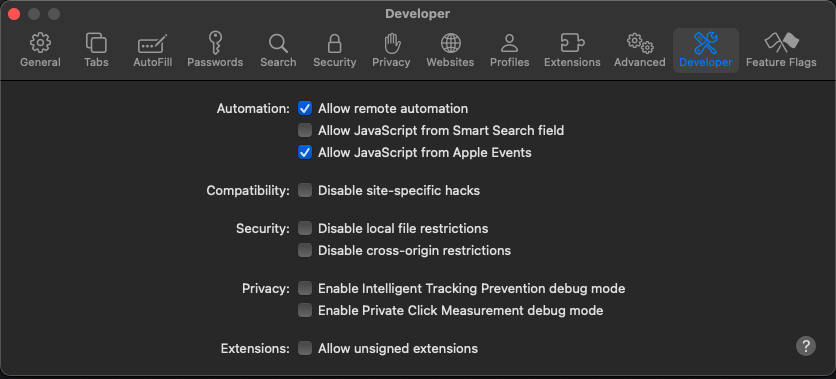
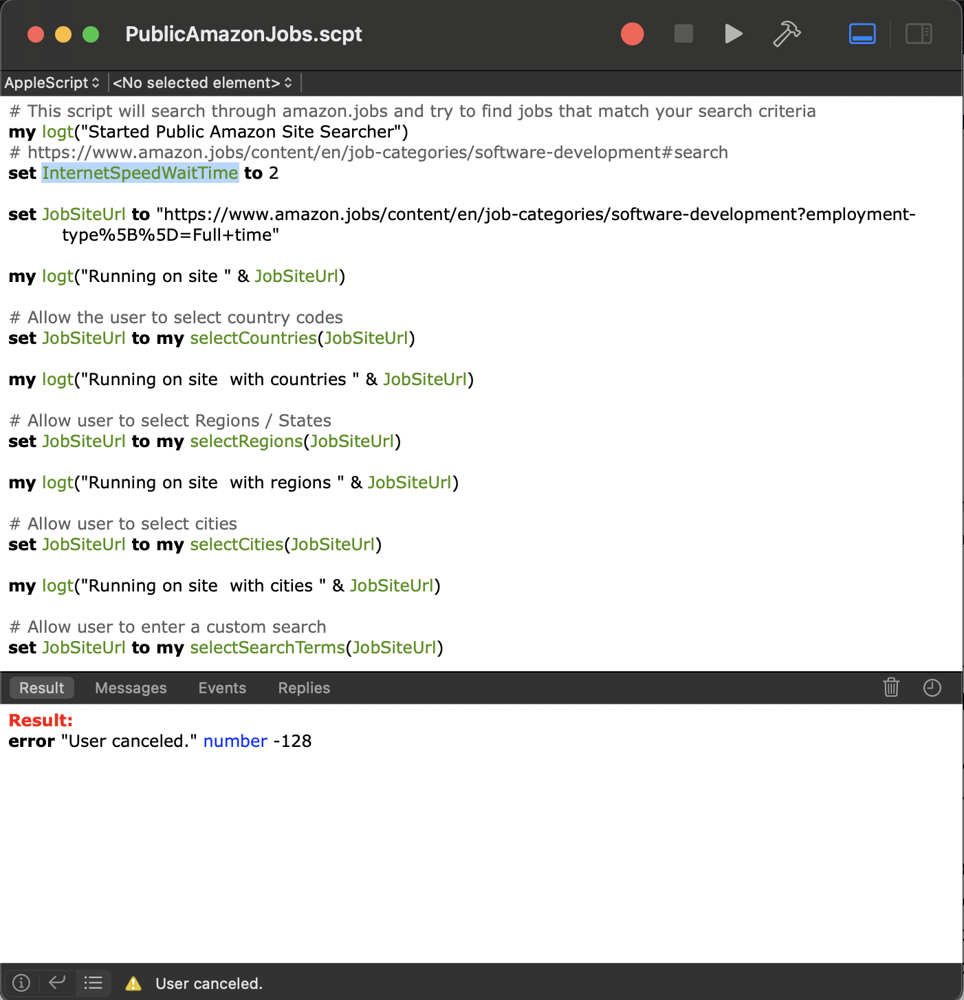

# PublicJobSearcher
This project helps people search for and apply for jobs more easily

## Running the Scripts

### Apple

First need to be on a Mac computer for the code in `./apple` to work.

Need to open `Safari` and turn on `developer mode` then additional setting to allow JavaScript to be injected via the `AppleScript code.`

* Open Safari -> Preferences `⌘,`



* Turn on developer mode in advanced options:
    * Near the bottom: `Show features for web developers`



* Allow Apple Scripts to run Safari and inject JavaScript
    * Open the `Developer` tab.
    * `Automation` section (near the top):
        * `Allow Remote Automation`
        * `Allow JavaScript from Apple Events`



* Use the Apple `Script Editor` to open `./apple/PublicAmazonJobs.scpt`
    * Click the `Show or Hide Logs button` near the bottom. It is a Menu icon.
    * Click `Messages` to see the output logs while it is running.
    * Click the `Play / Run Button` near the top.



* Prompts will be displayed to help. Country isn't optional but all other feilds are.

* Note: can edit `InternetSpeedWaitTime` from 2 to other numbers for slower or longer wait times depending on internet speed.

### Results

Results from running the apple script code is in `./apple/results/amazon-job-search-results-<data>.txt`

All of the data from each details page will be in the text file to make it easier to find jobs that you like rather than looking through each one individually. Making it easier to apply to multiple jobs at the same time.

## Windows / Linux / Universal

Need to have node installed. Recommend install `NVM` to begin with.

### Install Requirements

```
nvm install v20.11.1
```

`yarn install` or `npm install`

### Running script

`yarn amazon_search` or `node ./javascript/src/amazon_prompts.mjs`


### Errors

* `Bad CPU type in executable: '/Users/tmosest/Library/Application Support/pyppeteer/local-chromium/1181205/chrome-mac/Chromium.app/Contents/MacOS/Chromium'` 
    * MAC: `softwareupdate --install-rosetta`

## TODO
* Create application script
* Allow users to search by years of experience by asking a range.
* Help users to auto apply
* Create a map of regions / states to cities so the search isn't over populated
* Ask users how slow their internet is and then update the wait parameter from there.
* Allow users to submit resume and have it scan for experience and auto upload to application like my referral code.

## References
* [Puppeteer](https://github.com/puppeteer/puppeteer)
* [Prompter](https://github.com/terkelg/prompts)
